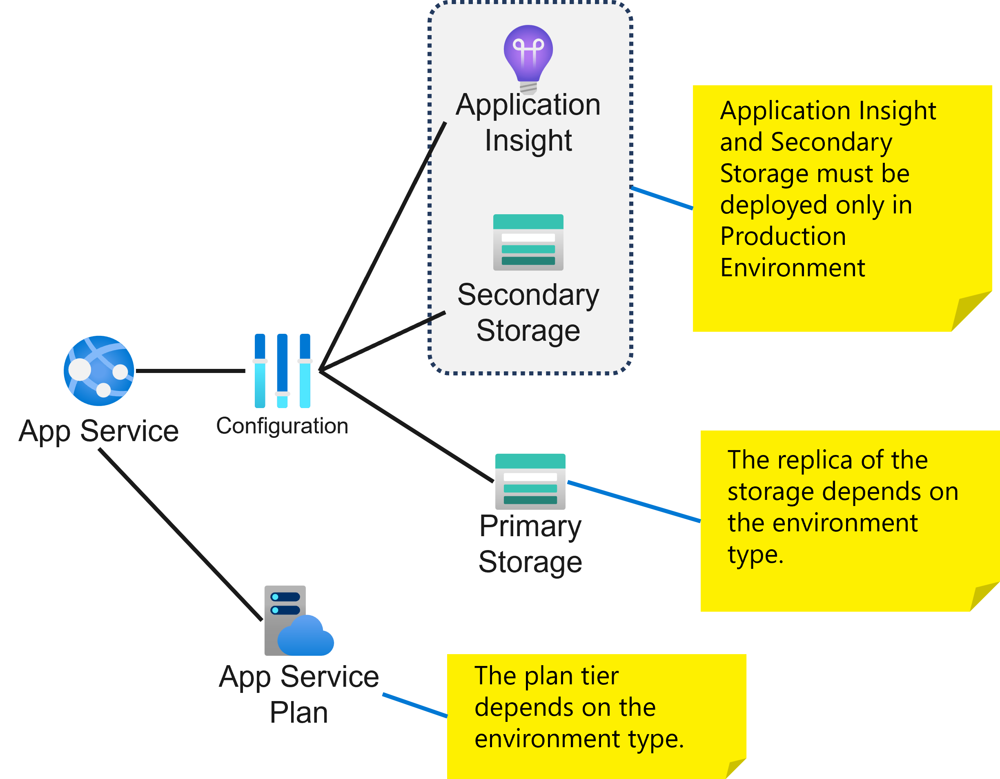

# Bicep demos for DevOps Time episode
This repo contains the demos for the DevOps Time episode called "Bicep e DevOps: la coppia vincente nell'IaC su Azure!".
You can find the recording of the episode <a href="https://www.ugidotnet.org/tv/episodio/3132/DevOps-Time/Bicep-e-DevOps-la-coppia-vincente-nell-IaC-su-Azure" target="_blank">here</a>. The episode is in Italian language.

## Demo architecture
The templates create a solution based on the following picture:



We suppose to have 3 different environments: dev, test and prod.
The services we must deploy in the solution depends on the environment:
* ApplicationInsight and secondary storage must be deployed only in production environment
* The plan of the App Service Plan depends on the environment type
* The SKU of the primary storage depends on the environment type


## CI/CD pipelines
In the `.github/workflow` and `.ado` folders you can find the CI/CD for GitHub and Azure Devops platform.

### Azure DevOps
To execute the pipeline, you need to create a Azure DevOps project and setup a pipeline from file retrieving it from GitHub. 
You can have more info about how to proceed <a href="https://learn.microsoft.com/en-us/azure/devops/pipelines/repos/github?view=azure-devops&tabs=yaml" target="_blank">here</a>.

Then you need to configure a service connection in your Azure DevOps project (called `DeployConnection`) with contributor role in the destination resource groups (variable `resourceGroupName` in the different pipeline stages). 
You can find more info about how to configure it <a href="https://learn.microsoft.com/en-us/azure/devops/pipelines/library/service-endpoints?view=azure-devops&tabs=yaml" target="_blank">here</a>.

### GitHub workflow
To execute the GitHub workflow, you need to use an Azure service principal and store its credential in the GitHub secret called `AZURE_CREDENTIAL`.
To create an Azure service principal you can use the following command:

```bash
az ad sp create-for-rbac --sdk-auth --name GitHubPipelineSP --role 'Contributor' --scopes '/subscriptions/<subscription id>/resourceGroups/<resource group>'
```

where:
* `subscription id` is the id of your Azure subscription;
* `resource group` is the resource group where you deploy the solution (you can find the name of the resource groups in the YAML file for the workflow).

The previous command response is something similar to the following:

```json
{
  "clientId": "******************************",
  "clientSecret": "**********************************",
  "subscriptionId": "***************************",
  "tenantId": "************************",
  ....
}
```


You need to create the secret in the repo and copy the previous JSON inside it.
To know how you can create a secret in GitHub repo, follow the tutorial <a href="https://docs.github.com/en/codespaces/managing-codespaces-for-your-organization/managing-encrypted-secrets-for-your-repository-and-organization-for-github-codespaces#adding-secrets-for-a-repository" target="_blank">here</a>.